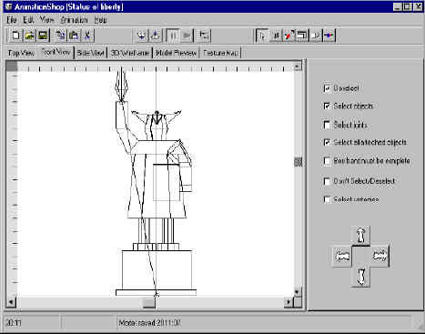



## ThreeDAnimation

### Description

Create 3D models with the following features:

Load, Save, Reverse, Scale, Name, Save, Compile

Expand, Group, Play, Copy, Rotate, Bend, Create

Customize, Render, Animate, Import, Zoom, Flip

Help and examples included.
 
### More Info
 

             |
---                |---
**Submitted On**   |2001-07-11 20:09:46
**By**             |[DeadFred](https://github.com/Planet-Source-Code/PSCIndex/blob/master/ByAuthor/deadfred.md)
**Level**          |Intermediate
**User Rating**    |4.8 (92 globes from 19 users)
**Compatibility**  |VB 5\.0, VB 6\.0
**Category**       |[Graphics](https://github.com/Planet-Source-Code/PSCIndex/blob/master/ByCategory/graphics__1-46.md)
**World**          |[Visual Basic](https://github.com/Planet-Source-Code/PSCIndex/blob/master/ByWorld/visual-basic.md)
**Archive File**   |[ThreeDAnim226337122001\.zip](https://github.com/Planet-Source-Code/deadfred-threedanimation__1-24949/archive/master.zip)

